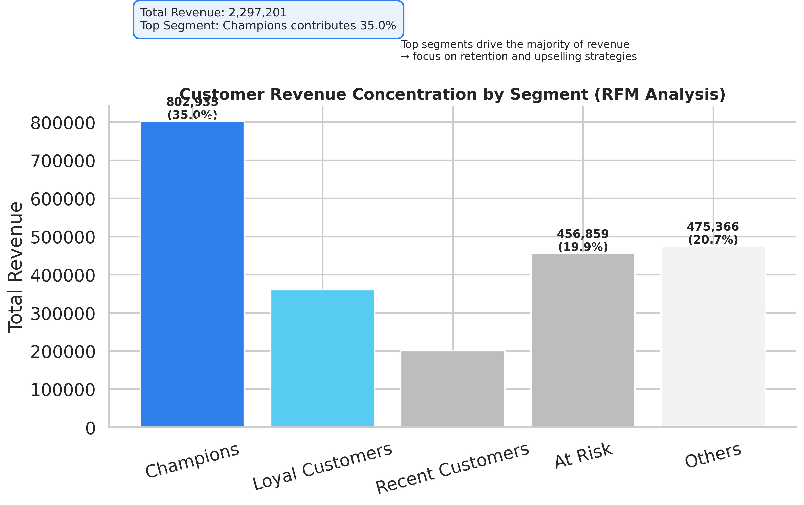

  

<h1 align="center">Customer Behaviour & Revenue Analysis Using RFM Segmentation</h1>

---

## 📌 Overview

This project analyzes customer behavior and sales performance using the Superstore dataset to identify revenue concentration, detect churn risk, and support targeted retention and revenue optimization strategies.

By applying **RFM (Recency, Frequency, Monetary) segmentation**, the analysis uncovers high-value customers, at-risk segments, and actionable opportunities for business growth.

---

## ❓ Business Questions

* Which customer segments generate the most revenue?
* Which customers are at risk of churn?
* How does customer behavior impact profitability?
* How can the business improve retention and revenue?

---

## 🎯 Why This Project Matters

Businesses often treat all customers equally, leading to inefficient marketing strategies and missed revenue opportunities.

This project demonstrates how customer segmentation can:

* Improve customer retention
* Increase revenue through targeted strategies
* Optimize marketing and discount decisions
* Enable data-driven business growth

---

## 📂 Project Notebook

🔗 [View Full Python Analysis Notebook (EDA + RFM Segmentation)](./Customer_Behaviour_and_Revenue_Analysis_Superstore_RFM.ipynb)

---

## 🛠 Tools & Technologies

* Python
* Pandas
* NumPy
* Matplotlib
* Seaborn

---

## 📊 Key Analysis

* Conducted exploratory data analysis (EDA) to identify sales and profit trends
* Engineered features including shipping delays and time-based metrics
* Applied RFM segmentation to classify customers by value and behavior
* Analyzed revenue distribution across customer segments
* Developed an executive-level visualization for stakeholder communication

---

## 📌 Key Insights

* Revenue is highly concentrated among high-value customers, with **Champions contributing ~35%**
* **At Risk and Other segments** represent both revenue opportunities and churn risk
* Discounts show a negative relationship with profit in multiple cases
* Shipping delays may impact customer satisfaction and retention
* A small proportion of customers drives the majority of revenue (**Pareto principle**)

---

## 📈 Business Impact

* Enables targeted marketing for high-value customers
* Identifies churn risk to prevent revenue loss
* Improves pricing and discount strategies
* Supports data-driven decision-making for business growth

---

## 🚀 Business Recommendations

* Prioritize retention and upselling strategies for high-value customers
* Re-engage At Risk customers through targeted campaigns
* Optimize discount strategies to protect profit margins
* Improve logistics performance to enhance customer experience

---

## 📷 Executive Visualization

The chart below shows revenue distribution across customer segments, highlighting concentration among high-value customers.

  

  <em>Revenue concentration across customer segments (RFM Analysis)</em>

---

## 🧠 Skills Demonstrated

* Data Cleaning & Feature Engineering
* Exploratory Data Analysis (EDA)
* Customer Segmentation (RFM Analysis)
* Data Visualization & Storytelling
* Business Insight Development

---

## 📂 Project Structure

customer-behaviour-revenue-analysis-rfm/

│
├── Customer_Behaviour_and_Revenue_Analysis_Superstore_RFM.ipynb
├── rfm_executive_visual.png
├── inferaiq_logo.png
├── inferaiq_banner_premium.png
└── README.md

---

## 👤 Author
**Daniel Damilola Amosun**  
Data Analyst | Aspiring Data Scientist  

